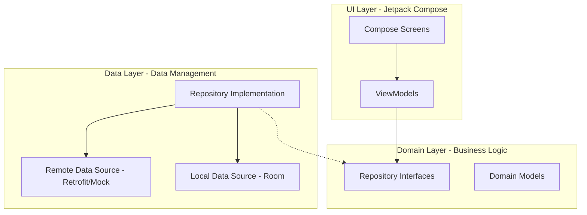
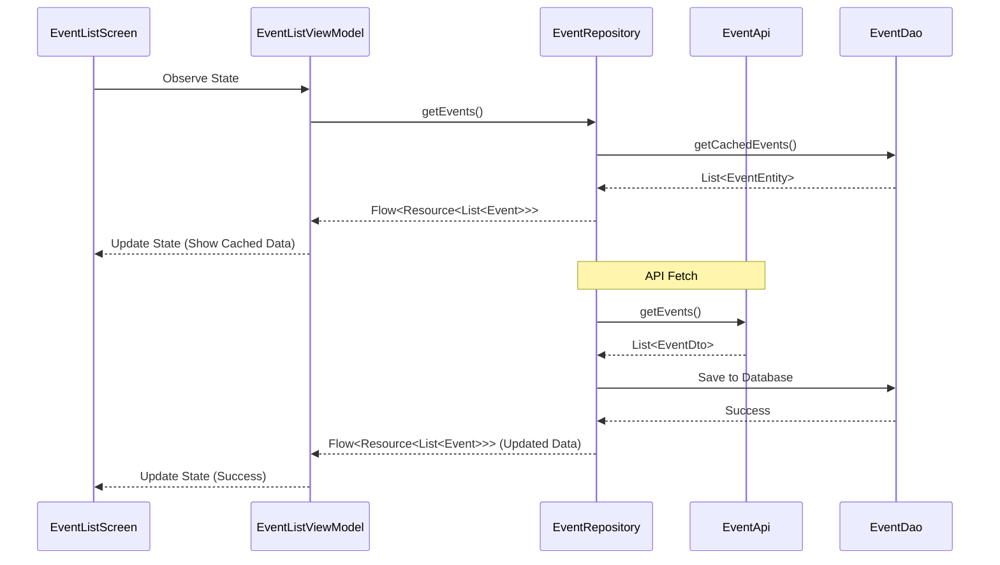

# Local Event Explorer

A production-minded Android application for discovering and bookmarking local events.

## Features
- **Event Listing**: View a list of nearby events fetched from a remote API.
- **Offline First**: Events are cached in a local Room database.
- **Bookmarking**: Save your favorite events locally.
- **Detailed View**: See more information about an event, including location and time.
- **Map Integration**: Deep link to Google Maps for navigation.
- **Background Refresh**: Periodically updates event data using WorkManager.
- **Clean Architecture**: Built using MVVM with a clear separation of concerns.

## Tech Stack
- **Language**: Kotlin
- **UI**: Jetpack Compose
- **DI**: Hilt
- **Networking**: Retrofit + OkHttp
- **Database**: Room
- **Image Loading**: Coil
- **Async**: Coroutines + Flow
- **Background Work**: WorkManager

## Architecture
The app follows Clean Architecture principles:
- **Domain**: Contains business logic, models, and repository interfaces.
- **Data**: Implements the repository interface, handles API calls, and local database operations.
- **UI**: Jetpack Compose screens and ViewModels.

### Architecture Diagram

### Sequence Diagram: Fetching Events

## Setup Instructions
1. Clone the repository.
2. Open in Android Studio (Ladybug or newer).
3. Perform a **Gradle Sync**.
4. Run the app on an emulator or physical device.

## Engineering Standards
- **SOLID Principles**: Applied throughout the architecture.
- **Repository Pattern**: Centralized data access.
- **Dependency Injection**: Decoupled components for testability.
- **Error Handling**: Graceful handling of network failures.
- **Resource Management**: Efficient use of background workers and database caching.

## Demo
<video src="media/Location.mp4" width="320" height="640" controls></video>
